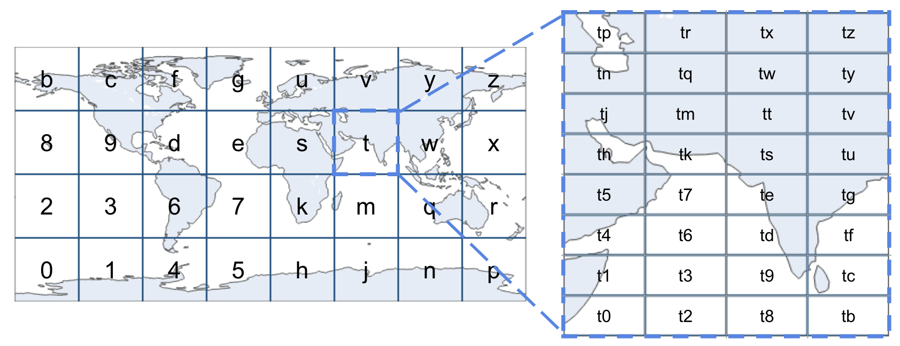

Go

- Gin
- Air for live reload (`.air.toml`)

Run Dev Server:

```
go get
go mod tidy
air
```

Run cron scripts:

```
make cron-wa
make cron-nsw # nsw and tas
make cron-sa # qld and sa
```

## Architecture

### Folder structure

- `cmd/api` - API
- `cmd/cron` - scheduled cron job
- `internal/firehose` - Kinesis Data Firehose publisher
- `internal/providers` - upstream fuel price fetchers
- `internal/routes` - Gin route handlers
- `internal/store` - DynamoDB persistence
- `internal/types` - shared types
- `internal/util`
  - `geohash/` - `CreateGeohash(Station) StationItem`

### Geohashing

Used to query stations within a range of lat/lng coordinates.



| Geohash Length   | Cell Width         | Positional Precision        |
| ---------------- | ------------------ | --------------------------- |
| **1 character**  | $\approx$ 5,000 km | Region/continent level      |
| **2 characters** | $\approx$ 1,250 km | Country/large region level  |
| **3 characters** | $\approx$ 156 km   | Large metropolitan area     |
| **4 characters** | $\approx$ 39 km    | City/county level           |
| **5 characters** | $\approx$ 4.9 km   | Neighborhood/district level |
| **6 characters** | $\approx$ 1.2 km   | Urban block level           |
| **7 characters** | $\approx$ 152 m    | City block level            |
| **8 characters** | $\approx$ 38 m     | Building/property level     |

At a precision level 8, it might look like this: `r1dx8t13`
Therefore, we can find all the stations within a city, by querying for fields starting with `r1dx...`

### DynamoDB table

#### Stations

| Key     | Field              | Composition         | Purpose                |
| ------- | ------------------ | ------------------- | ---------------------- |
| PK      | `RegionGeohash`    | `<shard 1-10>#<p1>` | World / region queries |
| SK      | `TownGeohash`      | `<p8>#<station_id>` | Fine-grained range     |
| GSI1 PK | `SubRegionGeohash` | `<p4>`              | City-level queries     |
| GSI1 SK | `TownGeohash`      | `<p8>#<station_id>` | Town-level queries     |

We query the table using this guide, using the provided lat/lng bounding box provided by the user:
| diagonal | precision | shards | path |
| ----------- | --------- | ------ | ------------------------------------------ |
| ≥ 2000 km | p1 | 2/10 | base table, PK only |
| 400–2000 km | p2 | 4/10 | base table, PK + `begins_with(SK, p2cell)` |
| 80–400 km | p3 | 8/10 | base table, PK + `begins_with(SK, p3cell)` |
| < 80 km | p4 | 10/10 | `GSI_SubRegion`, PK EQ |

#### Providers-Auth

Used by `internal/store/auth.go` to cache any auth tokens necessary for pulling data from the provider's API.

| Key | Field          | Value                    | Purpose                       |
| --- | -------------- | ------------------------ | ----------------------------- |
| PK  | `provider`     | `nsw_tas`                | Single-row cache per provider |
|     | `access_token` | `ey...`                  | Access Token                  |
|     | `expires_in`   | `unix timestamp`         | Expiry timestamp              |
|     | `issued_at`    | `unix timestamp`         | API issued at timestamp       |
|     | `ttl`          | `issued_at + expires_in` | auto expire items             |

### Cron / EventBridge schedules

The cron Lambda (`gofuel-cron`) is invoked by EventBridge Scheduler. Each
schedule carries a constant JSON payload:

```ts
{
  "provider": "wa",
  "day": "" | "tomorrow" // FuelWatch (WA) allows fetching tomorrow's prices from 2:30PM AWST
}
```

| Schedule                  | Expression                     | Payload                              | Cadence         |
| ------------------------- | ------------------------------ | ------------------------------------ | --------------- |
| `gofuel-cron-wa-tomorrow` | `cron(0 16 * * ? *)`           | `{"provider":"wa","day":"tomorrow"}` | Daily, 4PM AWST |
| `gofuel-cron-nsw-tas`     | `cron(0 5,9,12,15,17 * * ? *)` | `{"provider":"nsw_tas","day":""}`    | 5×/day          |
| `gofuel-cron-sa-qld`      | `cron(0 5,9,12,15,17 * * ? *)` | `{"provider":"sa_qld","day":""}`     | 5×/day          |

### Docker (multi-target)

The `Dockerfile` builds either entry point via `--build-arg FUNCTION=...`

- API (default): `docker build -t gofuel .`
- Cron: `docker build --build-arg FUNCTION=cron -t gofuel:cron-latest .`

Cron images are tagged `gofuel:cron-*` in the same ECR repo as the API.

### Environment variables (see `.env.example`)

- `BASE_PATH` - API route prefix (Lambda)
- `ENVIRONMENT` - `local` / `prod`; when `local`, secrets are read from env
  vars, otherwise from SSM Parameter Store
- `NSW_TAS_API_KEY`, `NSW_TAS_API_SECRET` - OneGov NSW FuelAPI creds
- `SA_API_KEY`, `QLD_API_KEY` - SA / QLD Fuel Pricing Information Scheme keys
- `DDB_TABLE_STATIONS` - DynamoDB Stations table name
- `DDB_TABLE_AUTH` - DynamoDB auth table name (OAuth token cache; PK `provider`, TTL on `ttl`)
- `PROVIDER` - (local cron only) provider to refresh (`wa` | `nsw_tas` | `sa_qld`)
- `DAY` - (local cron only) WA day param (`""` | `tomorrow`)

In prod the five API keys live in SSM Parameter Store under `/gofuel/*`:

| Env var (local)      | SSM path                     |
| -------------------- | ---------------------------- |
| `MAPS_KEY`           | `/gofuel/maps_key`           |
| `NSW_TAS_API_KEY`    | `/gofuel/nsw_tas_api_key`    |
| `NSW_TAS_API_SECRET` | `/gofuel/nsw_tas_api_secret` |
| `SA_API_KEY`         | `/gofuel/sa_api_key`         |
| `QLD_API_KEY`        | `/gofuel/qld_api_key`        |

Set each once after `terraform apply`:

```
aws ssm put-parameter --name /gofuel/maps_key --type String --value "..." --overwrite
```
